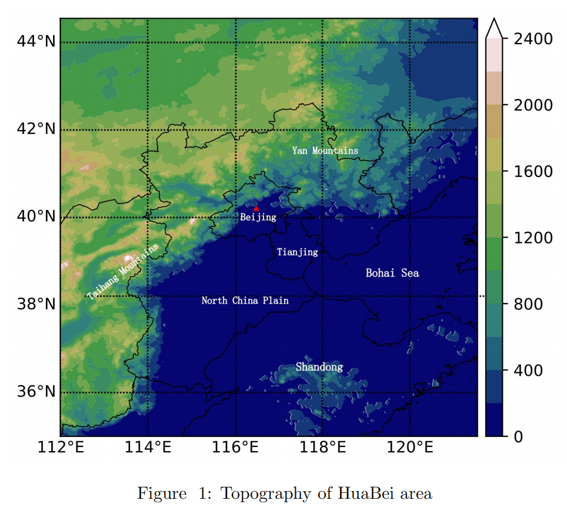
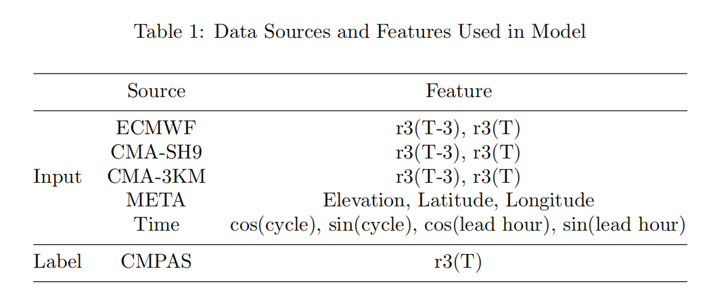
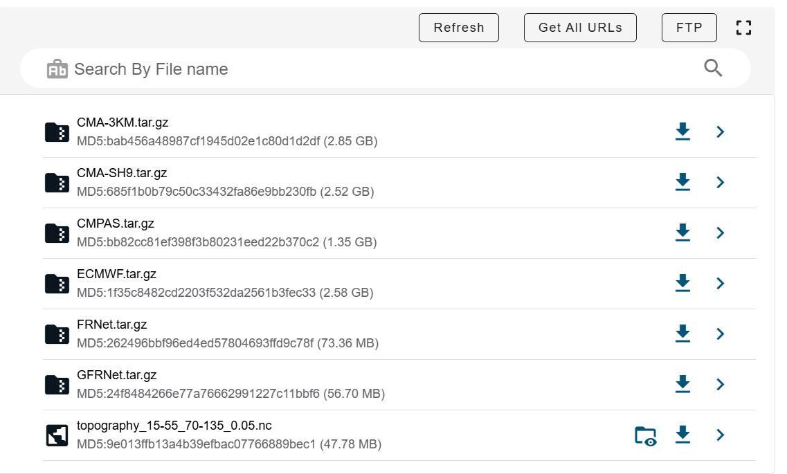

# PrecipitationForecast

1. Introduction

Accurate short-term rainfall forecasting is crucial for societal and economic activities. However, traditional weather prediction methods have inherent flaws that limit their ability to accurately predict rainfall. Recently, researchers have turned to deep learning to improve these forecasts. While these methods have shown promise, they still struggle to capture the detailed structure and intensity of rainfall. In this paper, we leverage the concept of Generative Adversarial Networks (GANs), which have been highly successful in image-related tasks, such as generating realistic high-resolution images. Our method combines multiple numerical weather prediction models to forecast 3-hour accumulated precipitation in northern China over the next 24 hours. Our approach significantly outperforms traditional methods, particularly for heavy rainfall. In addition, it can accurately depict the detailed structure of rainfall, addressing issues such as overestimation and blurry forecasts. This new model holds great potential for practical applications in weather forecasting.

2. Figures 

- Target area


- Data source and feature


- Model structure


3. Data Introduction
    Due to the large data size, we store the data here [Data](https://www.scidb.cn/en/detail?dataSetId=a42564aaec3340e982e997913b0baa48). Please follow gridforecast_v2/config/enrionment/hpc4.yaml formats requirement to reset your data and index file path.
    
    - For example, you should decompress the ECMWF.tar.gz into {your local path}/NWP_data/EC/EC_V3_nc/ecmwf_nc_0.05_31-45_108-124_rain.


4. Code Pipeline
    1. Pipeline Introduction
        - The whole pipeline consists of three parts: training, inference and evaluation, among which the module involving deep learning is implemented based on the Pytorch framework.
        - We use the [Hydra](https://github.com/facebookresearch/hydra) tool to achieve a reasonable modular design and convenient parameter control, the specific decoupling into the following modules:
          - dataloader
            - Implement multi-source data loading, necessary preprocessing, spatio-temporal alignment and partitioning of training sets, validation sets and test sets.
          - loss
            - loss functions, including many custom loss functions
          - lr_scheduler
            - Learning rate strategy
          - model
            - The model framework used by the generator, such as Unet
          - optimizer
            -  Which optimizer is used for model iteration
          - discriminator_loss
            - Loss function for discriminator
          - discriminator_model
            - The model structure used by the discriminator
          - environment
            - Specifies the path for storing the training data
            - Specifies the path to the csv file used to index the data
          - inference_wrapper
            - Encapsulation of the model inference process
          - train_test_wrapper
            - Encapsulation of the model training process
        Finally, we use src/factory.py to instantiate these modules.

        - For evaluation part, we implement four types of evaluation methods
          - binary method
            - Including TS, FAR, POD, ETS Bias, F1 etcs.
            - The above are point-wise evaluation.
          - continuous method
            - Including MSE, MAE, RMSE
          - cv method
            - Including SSIM, PSNR
          - spatial method
            - Including FSS.

    2. FRNet example
       1. Train
        ```
        PYTHONPATH=`pwd` python gridforecast_v2/src/training_v1.py \
            train_test_wrapper.config.num_epochs=200 \
            train_test_wrapper.config.patience=30 \
            train_test_wrapper.config.if_swa=False \
            train_test_wrapper.config.start_swa=5 \
            dataloader.batch_size=8 \
            dataloader/train=dataloader_v1_v2_index \
            dataloader/valid=dataloader_v1_v2_index \
            dataloader/test=dataloader_v1_v2_index \
            dataloader.train.lead_time_list='[0, 3, 6, 9, 12, 15, 18, 21, 24]' \
            dataloader.valid.lead_time_list='[0, 3, 6, 9, 12, 15, 18, 21, 24]' \
            dataloader.test.lead_time_list='[0, 3, 6, 9, 12, 15, 18, 21, 24]' \
            dataloader.train.data_feature.EC.rain.time.past_lead_time=3 \
            dataloader.train.data_feature.EC.rain.variables.rain.decoder_input=True \
            dataloader.train.data_feature.SMS.rain.time.time_res=3 \
            dataloader.train.data_feature.SMS.rain.time.past_lead_time=3 \
            dataloader.train.data_feature.SMS.rain.variables.r1.use=0 \
            dataloader.train.data_feature.SMS.rain.variables.r2.use=0 \
            dataloader.train.data_feature.GRAPES.rain.variables.rain.decoder_input=False \
            dataloader.train.data_feature.GRAPES.rain.time.time_res=3 \
            dataloader.train.data_feature.GRAPES.rain.time.past_lead_time=3 \
            dataloader.train.data_feature.GRAPES.rain.variables.r1.use=0 \
            dataloader.train.data_feature.GRAPES.rain.variables.r2.use=0 \
            model=unet_2d \
            loss=BEXPMSAELoss \
            optimizer=AdamW \
            lr_scheduler=CosineAnnealingLR \
            environment=hpc4
        ```
       2. Inference
        ```
        PYTHONPATH=`pwd` \
            python gridforecast_v2/src/inference_v1.py \
            inference_wrapper.config.checkpoint_path=${FRNet}/checkpoint.chk \
            input_dir=${FRNet} \
            dataloader/test=dataloader_v1_v2_index \
            dataloader.test.lead_time_list='[0, 3, 6, 9, 12, 15, 18, 21, 24]' \
            dataloader.test.data_feature.EC.rain.time.past_lead_time=3 \
            dataloader.test.data_feature.EC.rain.variables.rain.decoder_input=True \
            dataloader.test.data_feature.SMS.rain.time.time_res=3 \
            dataloader.test.data_feature.SMS.rain.time.past_lead_time=3 \
            dataloader.test.data_feature.SMS.rain.variables.r1.use=0 \
            dataloader.test.data_feature.SMS.rain.variables.r2.use=0 \
            dataloader.test.data_feature.GRAPES.rain.time.time_res=3 \
            dataloader.test.data_feature.GRAPES.rain.time.past_lead_time=3 \
            dataloader.test.data_feature.GRAPES.rain.variables.r1.use=0 \
            dataloader.test.data_feature.GRAPES.rain.variables.r2.use=0 \
            model=unet_2d \
            loss=BMSAELoss \
            environment=hpc4
        ```
       3. Evaluation
        ```
        PYTHONPATH=`pwd` \
            python gridforecast_v2/evaluation/metric_multi_source.py \
            --metric_setting_file gridforecast_v2/evaluation/eval_setting_9grades.yaml \
            --save_path ${your save directory} \
            --obs_path ${CMPAS directory} \
            --obs_var 'r3' \
            --forecast_paths '${FRNet}/inference_nc,${ECMWF}/ecmwf_nc_0.05_31-45_108-124_rain,${CMA-SH9}/SMS_nc_0.05_31-45_108-124_rain,${CMA-3KM}/GRAPES_nc_0.05_31-45_108-124_rain' \
            --forecast_variables 'pre_r3,r3,r3,r3' \
            --forecast_model_names 'FRNet,ECMWF,CMA-SH9,CMA-MESO' \
            --start_day '2021-07-01' \
            --end_day '2021-08-31' \
            --cycle_list '0,12' \
            --leadtime_list '3,6,9,12,15,18,21,24' \
            --groupby_coords 'year,month,cycle,leadtime'
        ```

    3. GFRNet example
       1. Train
        ```
        PYTHONPATH=`pwd` python \
            gridforecast_v2/src/training_gan_v2.py \
            output_dir=${your directory} \
            train_test_wrapper.config.num_epochs=200 \
            train_test_wrapper.config.display_interval=30 \
            train_test_wrapper.config.patience=20 \
            train_test_wrapper.config.if_swa=False \
            train_test_wrapper.config.start_swa=5 \
            train_test_wrapper.config.gen_loss_weight=50 \
            train_test_wrapper.config.dis_loss_weight=1 \
            train_test_wrapper.config.gen_step=9 \
            train_test_wrapper.config.dis_step=1 \
            train_test_wrapper.config.gradient_clipping=True \
            train_test_wrapper.config.clipping_threshold=0.2 \
            dataloader.batch_size=8 \
            dataloader/train=dataloader_v1_v4_dataset_index \
            dataloader/valid=dataloader_v1_v4_dataset_index \
            dataloader/test=dataloader_v1_v4_dataset_index \
            dataloader.train.lead_time_list='[0, 3, 6, 9, 12, 15, 18, 21, 24, 27]' \
            dataloader.valid.lead_time_list='[0, 3, 6, 9, 12, 15, 18, 21, 24, 27]' \
            dataloader.test.lead_time_list='[0, 3, 6, 9, 12, 15, 18, 21, 24, 27]' \
            dataloader.train.data_feature.OBS=null \
            dataloader.valid.data_feature.OBS=null \
            dataloader.test.data_feature.OBS=null \
            dataloader.train.data_feature.EC.rain.variables.rain.use=1 \
            dataloader.train.data_feature.EC.rain.time.past_lead_time=3 \
            dataloader.train.data_feature.EC.rain.time.future_lead_time=3 \
            dataloader.train.data_feature.EC.rain.variables.rain.decoder_input=True \
            dataloader.train.data_feature.SMS.rain.time.time_res=3 \
            dataloader.train.data_feature.SMS.rain.time.past_lead_time=3 \
            dataloader.train.data_feature.SMS.rain.time.future_lead_time=3 \
            dataloader.train.data_feature.SMS.rain.variables.rain.use=1 \
            dataloader.train.data_feature.SMS.rain.variables.r1.use=0 \
            dataloader.train.data_feature.SMS.rain.variables.r2.use=0 \
            dataloader.train.data_feature.GRAPES.rain.variables.rain.decoder_input=False \
            dataloader.train.data_feature.GRAPES.rain.time.time_res=3 \
            dataloader.train.data_feature.GRAPES.rain.time.past_lead_time=3 \
            dataloader.train.data_feature.GRAPES.rain.time.future_lead_time=3 \
            dataloader.train.data_feature.GRAPES.rain.variables.rain.use=1 \
            dataloader.train.data_feature.GRAPES.rain.variables.r1.use=0 \
            dataloader.train.data_feature.GRAPES.rain.variables.r2.use=0 \
            dataloader.train.data_feature.META.variables.lon.use=1 \
            dataloader.train.data_feature.META.variables.lat.use=1 \
            dataloader.train.data_feature.META.variables.z.use=1 \
            model=unet_2d \
            loss=BEXPMSAELoss \
            discriminator_model=dcgan \
            discriminator_loss=BCELoss \
            optimizer=AdamW \
            lr_scheduler=CosineAnnealingLR \
            environment=hpc4
        ```
       2. Inference
            ```
            PYTHONPATH=`pwd` \
                python gridforecast_v2/src/inference_gan_v2.py \
                input_dir=${your inference directory} \
                inference_wrapper.config.gen_checkpoint_path=${**/gen_checkpoint.chk}\
                inference_wrapper.config.dis_checkpoint_path=${**/dis_checkpoint.chk}\
                inference_wrapper.config.gen_loss_weight=50 \
                inference_wrapper.config.dis_loss_weight=1 \
                dataloader/test=dataloader_v1_v4_dataset_index \
                dataloader.test.lead_time_list='[0, 3, 6, 9, 12, 15, 18, 21, 24, 27]' \
                dataloader.test.data_feature.OBS=null \
                dataloader.test.data_feature.EC.rain.time.past_lead_time=3 \
                dataloader.test.data_feature.EC.rain.time.future_lead_time=3 \
                dataloader.test.data_feature.EC.rain.variables.rain.decoder_input=True \
                dataloader.test.data_feature.SMS.rain.time.time_res=3 \
                dataloader.test.data_feature.SMS.rain.time.past_lead_time=3 \
                dataloader.test.data_feature.SMS.rain.time.future_lead_time=3 \
                dataloader.test.data_feature.SMS.rain.variables.r1.use=0 \
                dataloader.test.data_feature.SMS.rain.variables.r2.use=0 \
                dataloader.test.data_feature.GRAPES.rain.variables.rain.decoder_input=False \
                dataloader.test.data_feature.GRAPES.rain.time.time_res=3 \
                dataloader.test.data_feature.GRAPES.rain.time.past_lead_time=3 \
                dataloader.test.data_feature.GRAPES.rain.time.future_lead_time=3 \
                dataloader.test.data_feature.GRAPES.rain.variables.r1.use=0 \
                dataloader.test.data_feature.GRAPES.rain.variables.r2.use=0 \
                model=unet_2d \
                discriminator_model=dcgan\
                loss=BEXPMSAELoss \
                discriminator_loss=BCELoss \
                environment=hpc4
            ```
       3. Evaluation
            ```
            PYTHONPATH=`pwd` \
                python gridforecast_v2/evaluation/metric_multi_source.py \
                --metric_setting_file gridforecast_v2/evaluation/eval_setting_4grades.yaml \
                --save_path ${your save directory} \
                --obs_path ${CMPAS directory} \
                --obs_var 'r3' \
                --forecast_paths "${ECMWF directory}/ecmwf_nc_0.05_31-45_108-124_rain,
                                ${CMA-SH9 directory}/SMS_nc_0.05_31-45_108-124_rain,
                                ${CMA-3KM directory}/GRAPES_nc_0.05_31-45_108-124_rain,
                                ${FRNet}/inference_nc,
                                ${GFRNet}/inference_nc" \
                --forecast_variables 'r3,r3,r3,pre_r3,pre_r3' \
                --forecast_model_names 'EC,SMS,GRAPES,DL,DL' \
                --forecast_show_model_names 'ECMWF,CMA-SH9,CMA-3KM,FRNet,GFRNet' \
                --start_day '2022-06-15' \
                --end_day '2022-08-31' \
                --cycle_list '0,12' \
                --leadtime_list '3,6,9,12,15,18,21,24' \
                --groupby_coords 'year,month,cycle,issue_time,day,leadtime'
            ```
