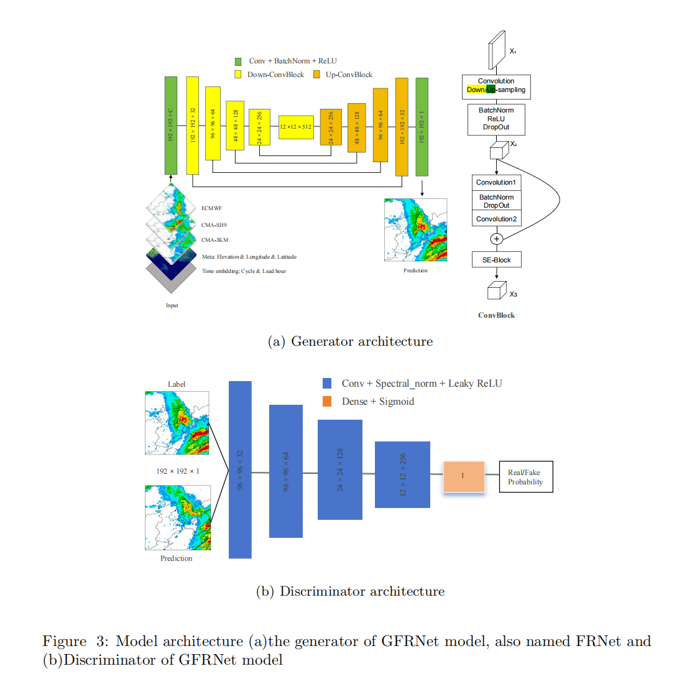

# PrecipitationForecast

1. Introduction

Accurate short-term rainfall forecasting is crucial for societal and economic activities. However, traditional weather prediction methods have inherent flaws that limit their ability to accurately predict rainfall. Recently, researchers have turned to deep learning to improve these forecasts. While these methods have shown promise, they still struggle to capture the detailed structure and intensity of rainfall. In this paper, we leverage the concept of Generative Adversarial Networks (GANs), which have been highly successful in image-related tasks, such as generating realistic high-resolution images. Our method combines multiple numerical weather prediction models to forecast 3-hour accumulated precipitation in northern China over the next 24 hours. Our approach significantly outperforms traditional methods, particularly for heavy rainfall. In addition, it can accurately depict the detailed structure of rainfall, addressing issues such as overestimation and blurry forecasts. This new model holds great potential for practical applications in weather forecasting.

2. Figures 

- Target area


- Data source and feature


- model structure




3. FRNet

- Train
```
PYTHONPATH=`pwd` \
    yhrun -p gpu -n1 -N1 -G1 --cpus-per-gpu 8 \
    ~/software/anaconda3/envs/pyxe/bin/python \
    gridforecast_v2/src/training_v1.py \
    train_test_wrapper.config.num_epochs=200 \
    train_test_wrapper.config.patience=30 \
    train_test_wrapper.config.if_swa=False \
    train_test_wrapper.config.start_swa=5 \
    dataloader.batch_size=8 \
    dataloader/train=dataloader_v1_v2_index \
    dataloader/valid=dataloader_v1_v2_index \
    dataloader/test=dataloader_v1_v2_index \
    dataloader.train.lead_time_list='[0, 3, 6, 9, 12, 15, 18, 21, 24]' \
    dataloader.valid.lead_time_list='[0, 3, 6, 9, 12, 15, 18, 21, 24]' \
    dataloader.test.lead_time_list='[0, 3, 6, 9, 12, 15, 18, 21, 24]' \
    dataloader.train.data_feature.EC.rain.time.past_lead_time=3 \
    dataloader.train.data_feature.EC.rain.variables.rain.decoder_input=True \
    dataloader.train.data_feature.SMS.rain.time.time_res=3 \
    dataloader.train.data_feature.SMS.rain.time.past_lead_time=3 \
    dataloader.train.data_feature.SMS.rain.variables.r1.use=0 \
    dataloader.train.data_feature.SMS.rain.variables.r2.use=0 \
    dataloader.train.data_feature.GRAPES.rain.variables.rain.decoder_input=False \
    dataloader.train.data_feature.GRAPES.rain.time.time_res=3 \
    dataloader.train.data_feature.GRAPES.rain.time.past_lead_time=3 \
    dataloader.train.data_feature.GRAPES.rain.variables.r1.use=0 \
    dataloader.train.data_feature.GRAPES.rain.variables.r2.use=0 \
    model=unet_2d \
    loss=BEXPMSAELoss \
    optimizer=AdamW \
    lr_scheduler=CosineAnnealingLR \
    environment=hpc4
```

- Inference
```
PYTHONPATH=`pwd` \
    python gridforecast_v2/src/inference_v1.py \
    inference_wrapper.config.checkpoint_path=${FRNet}/checkpoint.chk \
    input_dir=${FRNet} \
    dataloader/test=dataloader_v1_v2_index \
    dataloader.test.lead_time_list='[0, 3, 6, 9, 12, 15, 18, 21, 24]' \
    dataloader.test.data_feature.EC.rain.time.past_lead_time=3 \
    dataloader.test.data_feature.EC.rain.variables.rain.decoder_input=True \
    dataloader.test.data_feature.SMS.rain.time.time_res=3 \
    dataloader.test.data_feature.SMS.rain.time.past_lead_time=3 \
    dataloader.test.data_feature.SMS.rain.variables.r1.use=0 \
    dataloader.test.data_feature.SMS.rain.variables.r2.use=0 \
    dataloader.test.data_feature.GRAPES.rain.time.time_res=3 \
    dataloader.test.data_feature.GRAPES.rain.time.past_lead_time=3 \
    dataloader.test.data_feature.GRAPES.rain.variables.r1.use=0 \
    dataloader.test.data_feature.GRAPES.rain.variables.r2.use=0 \
    model=unet_2d \
    loss=BMSAELoss \
    environment=hpc4
```

- Evaluation
```
PYTHONPATH=`pwd` \
    python gridforecast_v2/evaluation/metric_multi_source.py \
    --metric_setting_file gridforecast_v2/evaluation/eval_setting_9grades.yaml \
    --save_path ${your save directory} \
    --obs_path ${CMPAS directory} \
    --obs_var 'r3' \
    --forecast_paths '${FRNet}/inference_nc,${ECMWF}/ecmwf_nc_0.05_31-45_108-124_rain,${CMA-SH9}/SMS_nc_0.05_31-45_108-124_rain,${CMA-3KM}/GRAPES_nc_0.05_31-45_108-124_rain' \
    --forecast_variables 'pre_r3,r3,r3,r3' \
    --forecast_model_names 'FRNet,ECMWF,CMA-SH9,CMA-MESO' \
    --start_day '2021-07-01' \
    --end_day '2021-08-31' \
    --cycle_list '0,12' \
    --leadtime_list '3,6,9,12,15,18,21,24' \
    --groupby_coords 'year,month,cycle,leadtime'
```


4. GFRNet

- Train example
```
PYTHONPATH=`pwd` \
    yhrun -p gpu -n1 -N1 -G1 --cpus-per-gpu 8 \
    ~/software/anaconda3/envs/pyxe/bin/python \
    gridforecast_v2/src/training_gan_v2.py \
    output_dir=${your directory} \
    train_test_wrapper.config.num_epochs=200 \
    train_test_wrapper.config.display_interval=30 \
    train_test_wrapper.config.patience=20 \
    train_test_wrapper.config.if_swa=False \
    train_test_wrapper.config.start_swa=5 \
    train_test_wrapper.config.gen_loss_weight=50 \
    train_test_wrapper.config.dis_loss_weight=1 \
    train_test_wrapper.config.gen_step=9 \
    train_test_wrapper.config.dis_step=1 \
    train_test_wrapper.config.gradient_clipping=True \
    train_test_wrapper.config.clipping_threshold=0.2 \
    dataloader.batch_size=8 \
    dataloader/train=dataloader_v1_v4_dataset_index \
    dataloader/valid=dataloader_v1_v4_dataset_index \
    dataloader/test=dataloader_v1_v4_dataset_index \
    dataloader.train.lead_time_list='[0, 3, 6, 9, 12, 15, 18, 21, 24, 27]' \
    dataloader.valid.lead_time_list='[0, 3, 6, 9, 12, 15, 18, 21, 24, 27]' \
    dataloader.test.lead_time_list='[0, 3, 6, 9, 12, 15, 18, 21, 24, 27]' \
    dataloader.train.data_feature.OBS=null \
    dataloader.valid.data_feature.OBS=null \
    dataloader.test.data_feature.OBS=null \
    dataloader.train.data_feature.EC.rain.variables.rain.use=1 \
    dataloader.train.data_feature.EC.rain.time.past_lead_time=3 \
    dataloader.train.data_feature.EC.rain.time.future_lead_time=3 \
    dataloader.train.data_feature.EC.rain.variables.rain.decoder_input=True \
    dataloader.train.data_feature.SMS.rain.time.time_res=3 \
    dataloader.train.data_feature.SMS.rain.time.past_lead_time=3 \
    dataloader.train.data_feature.SMS.rain.time.future_lead_time=3 \
    dataloader.train.data_feature.SMS.rain.variables.rain.use=1 \
    dataloader.train.data_feature.SMS.rain.variables.r1.use=0 \
    dataloader.train.data_feature.SMS.rain.variables.r2.use=0 \
    dataloader.train.data_feature.GRAPES.rain.variables.rain.decoder_input=False \
    dataloader.train.data_feature.GRAPES.rain.time.time_res=3 \
    dataloader.train.data_feature.GRAPES.rain.time.past_lead_time=3 \
    dataloader.train.data_feature.GRAPES.rain.time.future_lead_time=3 \
    dataloader.train.data_feature.GRAPES.rain.variables.rain.use=1 \
    dataloader.train.data_feature.GRAPES.rain.variables.r1.use=0 \
    dataloader.train.data_feature.GRAPES.rain.variables.r2.use=0 \
    dataloader.train.data_feature.META.variables.lon.use=1 \
    dataloader.train.data_feature.META.variables.lat.use=1 \
    dataloader.train.data_feature.META.variables.z.use=1 \
    model=unet_2d \
    loss=BEXPMSAELoss \
    discriminator_model=dcgan \
    discriminator_loss=BCELoss \
    optimizer=AdamW \
    lr_scheduler=CosineAnnealingLR \
    environment=hpc4
```


- inference
```
PYTHONPATH=`pwd` \
    python gridforecast_v2/src/inference_gan_v2.py \
    input_dir=${your inference directory} \
    inference_wrapper.config.gen_checkpoint_path=${**/gen_checkpoint.chk}\
    inference_wrapper.config.dis_checkpoint_path=${**/dis_checkpoint.chk}\
    inference_wrapper.config.gen_loss_weight=50 \
    inference_wrapper.config.dis_loss_weight=1 \
    dataloader/test=dataloader_v1_v4_dataset_index \
    dataloader.test.lead_time_list='[0, 3, 6, 9, 12, 15, 18, 21, 24, 27]' \
    dataloader.test.data_feature.OBS=null \
    dataloader.test.data_feature.EC.rain.time.past_lead_time=3 \
    dataloader.test.data_feature.EC.rain.time.future_lead_time=3 \
    dataloader.test.data_feature.EC.rain.variables.rain.decoder_input=True \
    dataloader.test.data_feature.SMS.rain.time.time_res=3 \
    dataloader.test.data_feature.SMS.rain.time.past_lead_time=3 \
    dataloader.test.data_feature.SMS.rain.time.future_lead_time=3 \
    dataloader.test.data_feature.SMS.rain.variables.r1.use=0 \
    dataloader.test.data_feature.SMS.rain.variables.r2.use=0 \
    dataloader.test.data_feature.GRAPES.rain.variables.rain.decoder_input=False \
    dataloader.test.data_feature.GRAPES.rain.time.time_res=3 \
    dataloader.test.data_feature.GRAPES.rain.time.past_lead_time=3 \
    dataloader.test.data_feature.GRAPES.rain.time.future_lead_time=3 \
    dataloader.test.data_feature.GRAPES.rain.variables.r1.use=0 \
    dataloader.test.data_feature.GRAPES.rain.variables.r2.use=0 \
    model=unet_2d \
    discriminator_model=dcgan\
    loss=BEXPMSAELoss \
    discriminator_loss=BCELoss \
    environment=hpc4
```

- Evaluation
  
```
PYTHONPATH=`pwd` \
    python gridforecast_v2/evaluation/metric_multi_source.py \
    --metric_setting_file gridforecast_v2/evaluation/eval_setting_4grades.yaml \
    --save_path ${your save directory} \
    --obs_path ${CMPAS directory} \
    --obs_var 'r3' \
    --forecast_paths "${ECMWF directory}/ecmwf_nc_0.05_31-45_108-124_rain,
                     ${CMA-SH9 directory}/SMS_nc_0.05_31-45_108-124_rain,
                     ${CMA-3KM directory}/GRAPES_nc_0.05_31-45_108-124_rain,
                     ${FRNet}/inference_nc,
                     ${GFRNet}/inference_nc" \
    --forecast_variables 'r3,r3,r3,pre_r3,pre_r3' \
    --forecast_model_names 'EC,SMS,GRAPES,DL,DL' \
    --forecast_show_model_names 'ECMWF,CMA-SH9,CMA-3KM,FRNet,GFRNet' \
    --start_day '2022-06-15' \
    --end_day '2022-08-31' \
    --cycle_list '0,12' \
    --leadtime_list '3,6,9,12,15,18,21,24' \
    --groupby_coords 'year,month,cycle,issue_time,day,leadtime'
```

